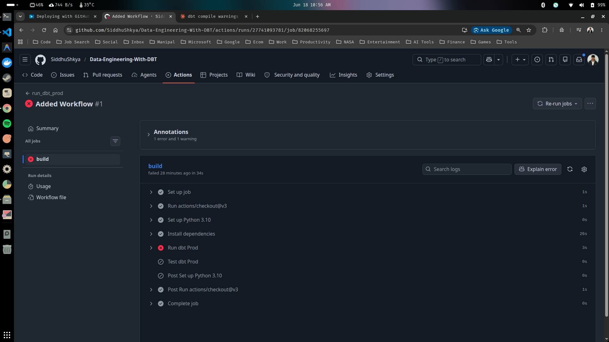

# Deploying Your DBT Project

Now that we've completed our entire DBT project, we're ready to move into production. 

However we have one small problem. If we go into our profiles.yml file, we can see that we only have dev and if you're having a production database and anyone can easily, just doing dbt run, it's not really a safe database to use.

So we need to create a seperate database for prod and create a seperate profile for prod and DBT makes that relatively easy to do. 

Let's get this started.

### 1. Utilizing multiple dbt profiles.

- Update you profiles.yml file to add a prod profile.

```yaml
nyc_parking_violations:
  outputs:
    dev: 
      type: duckdb
      path: '../data/nyc_parking_violations.db'
    prod:
      type: duckdb
      # Note that path is slightly different as GitHub actions.
      # Start in the root directory and not in the nyc_parking_violations directory
      path: '../data/prod_nyc_parking_violations.db'
  target: dev
```

- Creat a new DuckDB database file in the 'data' directory for prod, using the run-queries.ipynb notebook file.

```python
sql_query_import_1 = """
CREATE OR REPLACE TABLE parking_violation_codes AS
SELECT * 
FROM read_csv_auto(
    'data/DOF_Parking_Violation_Codes_20260603.csv',
    normalize_names=True
)
"""

sql_query_import_2 = """
CREATE OR REPLACE TABLE parking_violations_2025 AS
SELECT * 
FROM read_csv_auto(
    'data/sample_parking_violations_2025.csv',
    normalize_names=True
)
"""

with ddb.connect("data/prod_nyc_parking_violations.db") as con:
    con.sql(sql_query_import_1)
    con.sql(sql_query_import_2)
```

- After running the above code in run-queries.ipynb, we should see our new database in the data directory.

```text
.
├── data
│   ├── DOF_Parking_Violation_Codes_20260603.csv
│   ├── nyc_parking_violations.db  <-------------------------------------- # Your Dev Database 
│   ├── Parking_Violations_Issued_-_Fiscal_Year_2025_20260603.csv
│   ├── prod_nyc_parking_violations.db  <--------------------------------- # Your Production Database
│   └── sample_parking_violations_2025.csv
├── docs
├── .git
├── .gitattributes
├── .gitignore
├── LICENSE
├── logs
├── nyc_parking_violations
├── README.md
├── requirements.txt
├── run-queries.ipynb
├── sample.py
├── screenshots
└── venv
```

- Run your DBT models.

```sh
$ cd nyc_parking_violations/
$ dbt debug 

```sh
05:44:17  Running with dbt=1.8.9
05:44:17  dbt version: 1.8.9
05:44:17  python version: 3.11.15
05:44:17  python path: /home/siddhu/Desktop/Data-Engineering-With-DBT/venv/bin/python3.11
05:44:17  os info: Linux-6.14.0-37-generic-x86_64-with-glibc2.39
05:44:17  Using profiles dir at /home/siddhu/Desktop/Data-Engineering-With-DBT/nyc_parking_violations
05:44:17  Using profiles.yml file at /home/siddhu/Desktop/Data-Engineering-With-DBT/nyc_parking_violations/profiles.yml
05:44:17  Using dbt_project.yml file at /home/siddhu/Desktop/Data-Engineering-With-DBT/nyc_parking_violations/dbt_project.yml
05:44:17  adapter type: duckdb
05:44:17  adapter version: 1.8.4
05:44:17  [WARNING]: Deprecated functionality
The `tests` config has been renamed to `data_tests`. Please see
https://docs.getdbt.com/docs/build/data-tests#new-data_tests-syntax for more
information.
05:44:17  Configuration:
05:44:17    profiles.yml file [OK found and valid]
05:44:17    dbt_project.yml file [OK found and valid]
05:44:17  Required dependencies:
05:44:17   - git [OK found]

05:44:17  Connection:
05:44:17    database: nyc_parking_violations
05:44:17    schema: main
05:44:17    path: ../data/nyc_parking_violations.db
05:44:17    config_options: None
05:44:17    extensions: None
05:44:17    settings: {}
05:44:17    external_root: .
05:44:17    use_credential_provider: None
05:44:17    attach: None
05:44:17    filesystems: None
05:44:17    remote: None
05:44:17    plugins: None
05:44:17    disable_transactions: False
05:44:17  Registered adapter: duckdb=1.8.4
05:44:17    Connection test: [OK connection ok]

05:44:17  All checks passed!
```

- Run dbt compile, but this time set the target to prod.

```sh
$ dbt compile --target prod
```

```sh
05:53:12  Running with dbt=1.8.9
05:53:12  Registered adapter: duckdb=1.8.4
05:53:12  Found 10 models, 4 data tests, 427 macros
05:53:12  
05:53:13  Concurrency: 1 threads (target='prod')
05:53:13  
```

- Run dbt run and again set the target as prod.

```sh
$ dbt run --target prod
```
```sh
05:55:36  Running with dbt=1.8.9
05:55:36  Registered adapter: duckdb=1.8.4
05:55:36  Found 10 models, 4 data tests, 427 macros
05:55:36  
05:55:36  Concurrency: 1 threads (target='prod')
05:55:36  
05:55:36  1 of 6 START sql view model main.bronze_parking_violation_codes ................ [RUN]
05:55:36  1 of 6 OK created sql view model main.bronze_parking_violation_codes ........... [OK in 0.13s]
05:55:36  2 of 6 START sql view model main.bronze_parking_violations ..................... [RUN]
05:55:37  2 of 6 OK created sql view model main.bronze_parking_violations ................ [OK in 0.11s]
05:55:37  3 of 6 START sql view model main.silver_violation_tickets ...................... [RUN]
05:55:37  3 of 6 OK created sql view model main.silver_violation_tickets ................. [OK in 0.08s]
05:55:37  4 of 6 START sql view model main.silver_violation_vehicles ..................... [RUN]
05:55:37  4 of 6 OK created sql view model main.silver_violation_vehicles ................ [OK in 0.24s]
05:55:37  5 of 6 START sql table model main.gold_ticket_metrics .......................... [RUN]
05:55:37  5 of 6 OK created sql table model main.gold_ticket_metrics ..................... [OK in 0.49s]
05:55:37  6 of 6 START sql table model main.gold_vehicle_metrics ......................... [RUN]
05:55:38  6 of 6 OK created sql table model main.gold_vehicle_metrics .................... [OK in 0.32s]
05:55:38  
05:55:38  Finished running 4 view models, 2 table models in 0 hours 0 minutes and 1.63 seconds (1.63s).
05:55:38  
05:55:38  Completed successfully
05:55:38  
05:55:38  Done. PASS=6 WARN=0 ERROR=0 SKIP=0 TOTAL=6
```

*We now have our production database set up for us. We can also check it our for ourselves.* 

- Check the new production database using the run-queries.ipynb notebook file.

```python
sql_query = """
show tables; 
"""

with ddb.connect("data/prod_nyc_parking_violations.db") as con:
    display(con.sql(sql_query).df())
```
<table border="1" class="dataframe">
  <thead>
    <tr style="text-align: right;">
      <th></th>
      <th>name</th>
    </tr>
  </thead>
  <tbody>
    <tr>
      <th>0</th>
      <td>bronze_parking_violation_codes</td>
    </tr>
    <tr>
      <th>1</th>
      <td>bronze_parking_violations</td>
    </tr>
    <tr>
      <th>2</th>
      <td>gold_ticket_metrics</td>
    </tr>
    <tr>
      <th>3</th>
      <td>gold_vehicle_metrics</td>
    </tr>
    <tr>
      <th>4</th>
      <td>parking_violation_codes</td>
    </tr>
    <tr>
      <th>5</th>
      <td>parking_violations_2025</td>
    </tr>
    <tr>
      <th>6</th>
      <td>silver_violation_tickets</td>
    </tr>
    <tr>
      <th>7</th>
      <td>silver_violation_vehicles</td>
    </tr>
  </tbody>
</table>

*So now we can choose which ones we want to go for which rephrase. Simply now we can select which database we want to choose between within our DBT project with the various profiles.*

### 2. Deploying with GitHub Action Workflows.

So now we have a production database, and for our profiles, we have our production profile. We can run this automatically without our own intervention depending on our database and the system we are using. There are multiple ways to automate this task, however for this project we are going to keep it simple and use GitHub Action Workflows.

- You should have an workflow directory present in your whole project repository inside the .github folder, which is usually a hidden folder. If the folder is not there manually create them

```sh
$ mkdir .github
$ mkdir .github/workflows
```

- Create a yml configuration file called run-dbt-prod.yml inside the workflows folder.

```sh
& touch .github/workflows/run-dbt-prod.yml
```

- Your githun project structure should look like the below one.

```text
.
├── data
├── docs
├── .git
├── .gitattributes
├── .github
│   └── workflows
│       └── run-dbt-prod.yml  <---------------- # Your Workflow Config File
├── .gitignore
├── LICENSE
├── logs
├── nyc_parking_violations
├── README.md
├── requirements.txt
├── run-queries.ipynb
├── sample.py
├── screenshots
└── venv
```

- Copy paste the below yaml configuration to the run-dbt-prod.yml file.

```yml
# .github/workflows/run-dbt-prod.yml
name: run_dbt_prod

on:
  push:
    branches: [ "main" ]
  pull_request:
    branches: [ "main" ]
  # schedule:
  #   - cron: '0 8 * * *'

env:
  DBT_PROFILES_DIR: ./nyc_parking_violations
  DBT_PROJECT_DIR: ./nyc_parking_violations

jobs:
  build:

    runs-on: ubuntu-latest

    steps:
    - uses: actions/checkout@v3
    - name: Set up Python 3.10
      uses: actions/setup-python@v3
      with:
        python-version: "3.10"
    - name: Install dependencies
      run: |
        python -m pip install --upgrade pip
        if [ -f requirements.txt ]; then pip install -r requirements.txt; fi
    - name: Run dbt Prod
      run: |
        dbt debug
        dbt compile --target prod
        dbt run --target prod
    - name: Test dbt Prod
      run: |
        dbt test --target prod
```

- Now add, commit and push the changes to github to trigger the workflow.

```sh
$ git add .
$ git commit -m 'Added Workflow'
$ git push origin main
```

- You should see your workflow running from your github website with the repo. You will also eventually notice an error stating that a job failed.



*This failure was intentional and to undertand this you should go back to your profiles.yml file.*

```yml
nyc_parking_violations:
  outputs:
    dev: 
      type: duckdb
      path: '../data/nyc_parking_violations.db'
    prod:
      type: duckdb
      # Note that path is slightly different as GitHub actions.
      # Start in the root directory and not in the nyc_parking_violations directory
      path: '../data/prod_nyc_parking_violations.db'
  target: dev
```

*You can see the path is based on our DBT project directory, but GitHub actions isn't starting from the nyc_parking_violations folder. Its actually starting from the root directory. So to fix it, we just need tp update the path*

- Update the path for the prod field.

```yml
nyc_parking_violations:
  outputs:
    dev: 
      type: duckdb
      path: '../data/nyc_parking_violations.db'
    prod:
      type: duckdb
      # Note that path is slightly different as GitHub actions.
      # Start in the root directory and not in the nyc_parking_violations directory
      path: './data/prod_nyc_parking_violations.db'
  target: dev
```

- Again add, commit and push the changes to github to trigger the workflow.

```sh
$ git add .
$ git commit -m 'Updated profiles.yml file'
$ git push origin main
```