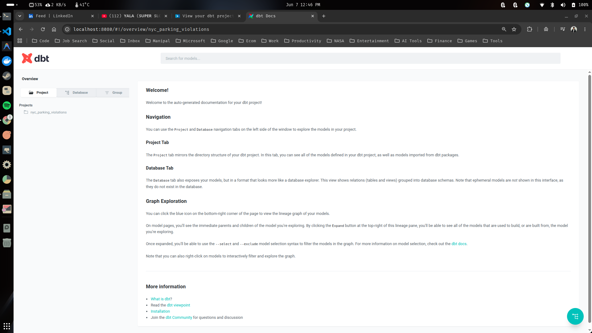
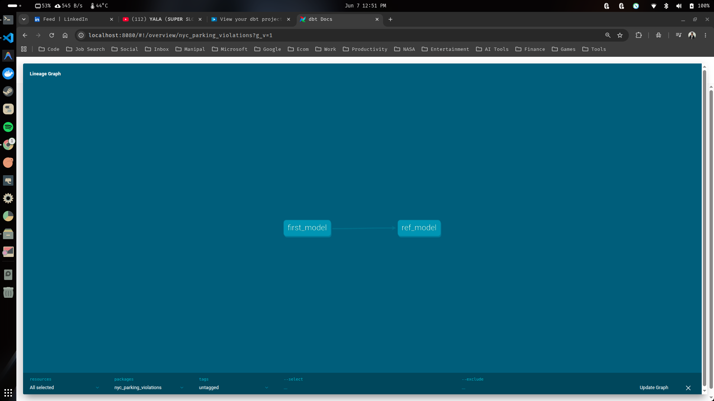
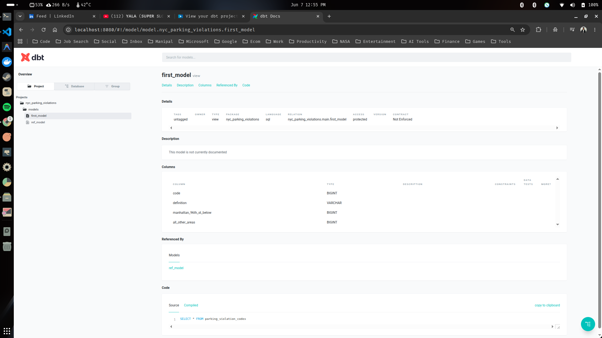

# DBT Ref Statement

DBT enables some useful tools for SQL files. Specifically, the most importnat syntax within DBT are ref statements. 

Ref statement example:

```text
{{ref('your_dbt_model_name')}}
```

*We have double curly brackets, the ref command. parrenthesis, the name of our model as a string, and then you close out the brackets.*

> [!NOTE]
> This syntax is powerful as it allows DBT to create lineage for our data transformations, essential for orchestrations, creating dependencies, and documentation. The ref statement specifically is whats called jinja syntax.

### 1. Create dbt model using ref statement

- Make sure you're inside your dbt project directory.

```sh
$ cd nyc_parking_violations/
```

- Create your first dbt model using ref using the below command.

```sh
touch models/example/ref_model.sql
```

- You should have your new model in your models directory.

```text
.
├── analyses
├── dbt_project.yml
├── .gitignore
├── logs
├── macros
├── models
│   └── example
│       ├── first_model.sql
│       └── ref_model.sql    <-------------- # Your New Model Here
├── profiles.yml
├── README.md
├── seeds
├── snapshots
├── target
└── tests
```

- Copy paste the below SQL query to your new moodel file.

```sql
SELECT
    COUNT(*)
FROM first_model
```

> [!NOTE]
> This will run in DBT and it'll show up in our database, but it won't have the ref statement to show that its connected to each other, and that's what makes DBT powerful. 

- Update the query to utilize the ref statement.

```sql
SELECT
    COUNT(*)
FROM {{ref('first_model')}}
```

### 2. Run your dbt model with the ref syntax

- Make sure you're inside your dbt project directory.

```sh
$ cd nyc_parking_violations/
```

- Run the below dbt debug command to make sure everything's working.

```sh
$ dbt debug
```

```sh
08:16:26  Running with dbt=1.8.9
08:16:26  dbt version: 1.8.9
08:16:26  python version: 3.11.15
08:16:26  python path: /home/siddhu/Desktop/Data-Engineering-With-DBT/venv/bin/python3.11
08:16:26  os info: Linux-6.14.0-37-generic-x86_64-with-glibc2.39
08:16:26  Using profiles dir at /home/siddhu/Desktop/Data-Engineering-With-DBT/nyc_parking_violations
08:16:26  Using profiles.yml file at /home/siddhu/Desktop/Data-Engineering-With-DBT/nyc_parking_violations/profiles.yml
08:16:26  Using dbt_project.yml file at /home/siddhu/Desktop/Data-Engineering-With-DBT/nyc_parking_violations/dbt_project.yml
08:16:26  adapter type: duckdb
08:16:26  adapter version: 1.8.4
08:16:26  Configuration:
08:16:26    profiles.yml file [OK found and valid]
08:16:26    dbt_project.yml file [OK found and valid]
08:16:26  Required dependencies:
08:16:26   - git [OK found]

08:16:26  Connection:
08:16:26    database: nyc_parking_violations
08:16:26    schema: main
08:16:26    path: ../data/nyc_parking_violations.db
08:16:26    config_options: None
08:16:26    extensions: None
08:16:26    settings: {}
08:16:26    external_root: .
08:16:26    use_credential_provider: None
08:16:26    attach: None
08:16:26    filesystems: None
08:16:26    remote: None
08:16:26    plugins: None
08:16:26    disable_transactions: False
08:16:26  Registered adapter: duckdb=1.8.4
08:16:26    Connection test: [OK connection ok]

08:16:26  All checks passed!
```

- Also run dbt compile to check.

```sh
$ dbt compile
```
```sh
08:17:33  Running with dbt=1.8.9
08:17:33  Registered adapter: duckdb=1.8.4
08:17:33  [WARNING]: Configuration paths exist in your dbt_project.yml file which do not apply to any resources.
There are 1 unused configuration paths:
- models.nyc_parking_violations.example
08:17:33  Found 2 models, 426 macros
08:17:33  
08:17:34  Concurrency: 1 threads (target='dev')
08:17:34  
```

- Finally, run your models using the dbt run command.

```sh
$ dbt run
```
```sh
08:19:01  Running with dbt=1.8.9
08:19:01  Registered adapter: duckdb=1.8.4
08:19:01  [WARNING]: Configuration paths exist in your dbt_project.yml file which do not apply to any resources.
There are 1 unused configuration paths:
- models.nyc_parking_violations.example
08:19:01  Found 2 models, 426 macros
08:19:01  
08:19:01  Concurrency: 1 threads (target='dev')
08:19:01  
08:19:01  1 of 2 START sql view model main.first_model ................................... [RUN]
08:19:01  1 of 2 OK created sql view model main.first_model .............................. [OK in 0.13s]
08:19:01  2 of 2 START sql view model main.ref_model ..................................... [RUN]
08:19:02  2 of 2 OK created sql view model main.ref_model ................................ [OK in 0.03s]
08:19:02  
08:19:02  Finished running 2 view models in 0 hours 0 minutes and 0.28 seconds (0.28s).
08:19:02  
08:19:02  Completed successfully
08:19:02  
08:19:02  Done. PASS=2 WARN=0 ERROR=0 SKIP=0 TOTAL=2
```

> [!NOTE]
> Notice how it runs the the first_model and then the ref_model second. This is ver intentional, not randomly. The ref statement allows dbt to understand the order of operations for the orchestration, that wouldn't happen if we didn't use the ref statement.

### 3. Check the output

- Go to your run-queries.ipynb notebook file and run the below block of code in a new cell. You should see a new table alongside nyc_parking_violations_2025 and nyc_parking_violation_codes in our database.

```python
sql_query = """
show tables; 
"""

with ddb.connect("data/nyc_parking_violations.db") as con:
    display(con.sql(sql_query).df())
```
<table border="1" class="dataframe">
  <thead>
    <tr style="text-align: right;">
      <th></th>
      <th>name</th>
    </tr>
  </thead>
  <tbody>
    <tr>
      <th>0</th>
      <td>first_model</td>
    </tr>
    <tr>
      <th>1</th>
      <td>parking_violation_codes</td>
    </tr>
    <tr>
      <th>2</th>
      <td>parking_violations_2025</td>
    </tr>
    <tr>
      <th>3</th>
      <td>ref_model</td>
    </tr>
  </tbody>
</table>

- You can also view the resulting table using the below block of code.

```python
sql_query = """
SELECT * FROM ref_model;
"""

with ddb.connect("data/nyc_parking_violations.db") as con:
    display(con.sql(sql_query).df())
```
<table border="1" class="dataframe">
  <thead>
    <tr style="text-align: right;">
      <th></th>
      <th>count_star()</th>
    </tr>
  </thead>
  <tbody>
    <tr>
      <th>0</th>
      <td>97</td>
    </tr>
  </tbody>
</table>

*We have successfully used the ref statement to create a dbt model and see the counts for our table.*

### 4. View your dbt project data lineage

To understand the true power of ref statement we need to run dbt docs, which allows us to visualize our DBT project.

- Generate the docs by simply running the below CLI command.

```sh
$ dbt docs generate
```
```sh
08:31:58  Running with dbt=1.8.9
08:31:58  Registered adapter: duckdb=1.8.4
08:31:59  [WARNING]: Configuration paths exist in your dbt_project.yml file which do not apply to any resources.
There are 1 unused configuration paths:
- models.nyc_parking_violations.example
08:31:59  Found 2 models, 426 macros
08:31:59  
08:31:59  Concurrency: 1 threads (target='dev')
08:31:59  
08:31:59  Building catalog
08:31:59  Catalog written to /home/siddhu/Desktop/Data-Engineering-With-DBT/nyc_parking_violations/target/catalog.json
```
*This command instructs our DBT project to look at all the metadata of our current DBT project and then to create some files inside the target directory.*

```text
├── target
│   ├── catalog.json
│   ├── compiled
│   │   └── nyc_parking_violations
│   ├── graph.gpickle
│   ├── graph_summary.json
│   ├── index.html
│   ├── manifest.json
│   ├── partial_parse.msgpack
│   ├── run
│   │   └── nyc_parking_violations
│   ├── run_results.json
│   └── semantic_manifest.json
```

*The above file are all generated by the dbt docs generate command that we don't have to deal with.*

- To actually see the true result generated from the above command, you need to run the below command.

```sh
$ dbt docs serve
```

*This command will create an local instance of a website based on your metadata of your documentation in the entire dbt project.*

- You should be redirected to the below page from your browser.



- You can also click the graph button at the bottom left to see your project's lineage graph.



*We can see the ref statement groing from first_model to ref_model. Imagine how useful these feature is gonna be when we have hundreds of models.*

- You can also go into our models themselves to see some additional info (metadata) about them.


---

<div align="center">

<h2>✦ Thank You For Reading This Guide ✦</h2>

> *May your pipelines never break and your queries always run fast.* 🚀

</div>