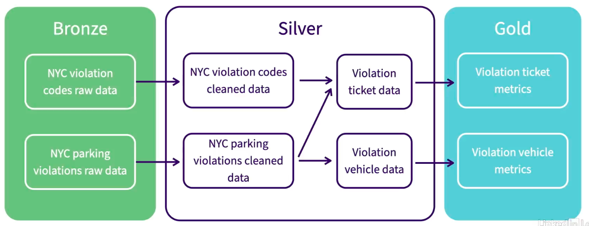

# Implementing Medallion Architecture With DBT

Now, we are going to convert the NYC parking violation data into the medallion architecture. To do this we are going to utilize dbt core for the SQL transformations, and our data pipeline and assets should look like the following when we're done. 

## Architecture for the project



We have:

- `🥉 Bronze`: This is for the raw data.
- `🥈 Silver`: This is for the transformed data model.
- `🥇 Gold`: This is for our metrics data.

## Project Breakdown

| **Layer** | **Goal** | **Tables** |
|-----------|----------|------------|
| 🥉 **Bronze Data** | Raw data with minimal cleaning and transformations | `bronze_parking_violation_codes`, `bronze_parking_violations` |
| 🥈 **Silver Data** | Cleaned data with applied business logic, ultimately in an established data model | `silver_parking_violation_codes`, `silver_parking_violations`, `silver_violation_tickets`, `silver_violation_vehicles` |
| 🥇 **Gold Data** | Metrics built on top of silver data that are often served to the business via dashboards | `gold_ticket_location_metrics`, `gold_vehicles_metrics` |

Now we have breakdown our project, we are finally ready to build our DBT Project.

### 1. Medallion Architecture : 🥉 Bronze Data

The bronze data should be in a mostly raw state, where minor tranformations are made to make it easier to manage data within your analytical database. For our usecase we will be taking a subset of the parking violation data columns. We should have the following tables added to our database when we're done:

- bronze_parking_violation_codes
- bronze_parking_violations

Lets get on with it.

- Create a new folder inside nyc_parking_violations/models directory named bronze.

```sh
$ cd nyc_parking_violations/models/
$ mkdir bronze
```

- Create your sql files for your models here.

```sh
$ touch bronze/bronze_parking_violation_codes.sql
$ touch bronze/bronze_parking_violations.sql
```

- Your models directory now should look like the below one.

```text
.
├── bronze
│   ├── bronze_parking_violation_codes.sql
│   └── bronze_parking_violations.sql
└── example
```

*We now have our both of our models ready and we're ready to create our bronze tables.*

- Copy pase the below SQL query to bronze/bronze_parking_violation_codes.sql

```sql
SELECT 
    code AS violation_code,
    definition,
    manhattan_96th_st_below,
    all_other_areas
FROM 
    parking_violation_codes
```

> [!NOTE]
> Note that we don't have to use the ref statement here as this is the first step of our data pipeline. Since, its the beginning it doesn't need to reference anything.

- Copy pase the below SQL query to bronze/bronze_parking_violations.sql

```sql
SELECT 
   summons_number,
   registration_state,
   plate_type,
   issue_date,
   violation_code,
   vehicle_body_type,
   vehicle_make,
   issuing_agency,
   vehicle_expiration_date,
   violation_location,
   violation_precinct,
   issuer_precinct,
   issuer_code,
   issuer_command,
   issuer_squad,
   violation_time,
   violation_county,
   violation_legal_code,
   vehicle_color,
   vehicle_year
FROM
    parking_violations_2025
```

*Now we are ready to build our bronze tables.*

- Run the dbt debug command.

```sh
$ dbt debug
```

```sh
07:14:16  Running with dbt=1.8.9
07:14:16  dbt version: 1.8.9
07:14:16  python version: 3.11.15
07:14:16  python path: /home/siddhu/Desktop/Data-Engineering-With-DBT/venv/bin/python3.11
07:14:16  os info: Linux-6.14.0-37-generic-x86_64-with-glibc2.39
07:14:17  Using profiles dir at /home/siddhu/.dbt
07:14:17  Using profiles.yml file at /home/siddhu/.dbt/profiles.yml
07:14:17  Using dbt_project.yml file at /home/siddhu/Desktop/Data-Engineering-With-DBT/nyc_parking_violations/dbt_project.yml
07:14:17  adapter type: duckdb
07:14:17  adapter version: 1.8.4
07:14:17  Configuration:
07:14:17    profiles.yml file [OK found and valid]
07:14:17    dbt_project.yml file [OK found and valid]
07:14:17  Required dependencies:
07:14:17   - git [OK found]

07:14:17  Connection:
07:14:17    database: dev
07:14:17    schema: main
07:14:17    path: dev.duckdb
07:14:17    config_options: None
07:14:17    extensions: None
07:14:17    settings: {}
07:14:17    external_root: .
07:14:17    use_credential_provider: None
07:14:17    attach: None
07:14:17    filesystems: None
07:14:17    remote: None
07:14:17    plugins: None
07:14:17    disable_transactions: False
07:14:17  Registered adapter: duckdb=1.8.4
07:14:17    Connection test: [OK connection ok]

07:14:17  All checks passed!
```

- Run the dbt compile command.

```sh
$ dbt compile
```

```sh
07:15:33  Running with dbt=1.8.9
07:15:33  Registered adapter: duckdb=1.8.4
07:15:33  Unable to do partial parsing because profile has changed
07:15:34  Found 4 models, 426 macros
07:15:34  
07:15:34  Concurrency: 1 threads (target='dev')
07:15:34  
```

- Finally, dbt run

```sh
$ dbt run
```
```sh
07:19:58  Running with dbt=1.8.9
07:19:58  Registered adapter: duckdb=1.8.4
07:19:58  Found 4 models, 426 macros
07:19:58  
07:19:58  Concurrency: 1 threads (target='dev')
07:19:58  
07:19:58  1 of 4 START sql view model main.bronze_parking_violation_codes ................ [RUN]
07:19:58  1 of 4 OK created sql view model main.bronze_parking_violation_codes ........... [OK in 0.12s]
07:19:58  2 of 4 START sql view model main.bronze_parking_violations ..................... [RUN]
07:19:58  2 of 4 OK created sql view model main.bronze_parking_violations ................ [OK in 0.03s]
07:19:58  3 of 4 START sql view model main.first_model ................................... [RUN]
07:19:59  3 of 4 OK created sql view model main.first_model .............................. [OK in 0.04s]
07:19:59  4 of 4 START sql view model main.ref_model ..................................... [RUN]
07:19:59  4 of 4 OK created sql view model main.ref_model ................................ [OK in 0.04s]
07:19:59  
07:19:59  Finished running 4 view models in 0 hours 0 minutes and 0.36 seconds (0.36s).
07:19:59  
07:19:59  Completed successfully
07:19:59  
07:19:59  Done. PASS=4 WARN=0 ERROR=0 SKIP=0 TOTAL=4
```

*We have successfully ran our DBT projects with the bronze models, meaning we have created our bronze tables.*

- Go to your run-queries.ipynb notebook and run the below block of code to verify the creation of tables.

```python
sql_query = '''
show tables; 
'''

with ddb.connect('data/nyc_parking_violations.db') as con:
    display(con.sql(sql_query).df())
```
<table border="1" class="dataframe">
  <thead>
    <tr style="text-align: right;">
      <th></th>
      <th>name</th>
    </tr>
  </thead>
  <tbody>
    <tr>
      <th>0</th>
      <td>bronze_parking_violation_codes</td>
    </tr>
    <tr>
      <th>1</th>
      <td>bronze_parking_violations</td>
    </tr>
    <tr>
      <th>2</th>
      <td>first_model</td>
    </tr>
    <tr>
      <th>3</th>
      <td>parking_violation_codes</td>
    </tr>
    <tr>
      <th>4</th>
      <td>parking_violations_2025</td>
    </tr>
    <tr>
      <th>5</th>
      <td>ref_model</td>
    </tr>
  </tbody>
</table>

- You can also view your bronze data by running the below block of codes.

    - `bronze_parking_violation_codes` table
    ```python
    sql_query = """
    SELECT * FROM bronze_parking_violation_codes
    LIMIT 3;
    """

    with ddb.connect("data/nyc_parking_violations.db") as con:
        display(con.sql(sql_query).df())
    ```
    <table border="1" class="dataframe">
    <thead>
        <tr style="text-align: right;">
        <th></th>
        <th>violation_code</th>
        <th>definition</th>
        <th>manhattan_96th_st_below</th>
        <th>all_other_areas</th>
        </tr>
    </thead>
    <tbody>
        <tr>
        <th>0</th>
        <td>1</td>
        <td>FAILURE TO DISPLAY BUS PERMIT</td>
        <td>515</td>
        <td>515</td>
        </tr>
        <tr>
        <th>1</th>
        <td>2</td>
        <td>NO OPERATOR NAM/ADD/PH DISPLAY</td>
        <td>515</td>
        <td>515</td>
        </tr>
        <tr>
        <th>2</th>
        <td>3</td>
        <td>UNAUTHORIZED PASSENGER PICK-UP</td>
        <td>515</td>
        <td>515</td>
        </tr>
    </tbody>
    </table>

    - `bronze_parking_violations` table
    ```python
    sql_query = """
    SELECT * FROM bronze_parking_violations
    LIMIT 3;
    """

    with ddb.connect("data/nyc_parking_violations.db") as con:
        display(con.sql(sql_query).df())
    ```
    <table border="1" class="dataframe">
    <thead>
        <tr style="text-align: right;">
        <th></th>
        <th>summons_number</th>
        <th>registration_state</th>
        <th>plate_type</th>
        <th>issue_date</th>
        <th>violation_code</th>
        <th>vehicle_body_type</th>
        <th>vehicle_make</th>
        <th>issuing_agency</th>
        <th>vehicle_expiration_date</th>
        <th>violation_location</th>
        <th>violation_precinct</th>
        <th>issuer_precinct</th>
        <th>issuer_code</th>
        <th>issuer_command</th>
        <th>issuer_squad</th>
        <th>violation_time</th>
        <th>violation_county</th>
        <th>violation_legal_code</th>
        <th>vehicle_color</th>
        <th>vehicle_year</th>
        </tr>
    </thead>
    <tbody>
        <tr>
        <th>0</th>
        <td>4906674367</td>
        <td>TX</td>
        <td>PAS</td>
        <td>2024-07-08</td>
        <td>36.0</td>
        <td>4D</td>
        <td>DODGE</td>
        <td>V</td>
        <td>0.0</td>
        <td>NaN</td>
        <td>0.0</td>
        <td>0.0</td>
        <td>0.0</td>
        <td>None</td>
        <td>None</td>
        <td>0416A</td>
        <td>QN</td>
        <td>True</td>
        <td>NaN</td>
        <td>2013.0</td>
        </tr>
        <tr>
        <th>1</th>
        <td>4906075502</td>
        <td>NY</td>
        <td>PAS</td>
        <td>2024-07-09</td>
        <td>36.0</td>
        <td>4DSD</td>
        <td>CHEVR</td>
        <td>V</td>
        <td>0.0</td>
        <td>NaN</td>
        <td>0.0</td>
        <td>0.0</td>
        <td>0.0</td>
        <td>None</td>
        <td>None</td>
        <td>0424P</td>
        <td>BX</td>
        <td>True</td>
        <td>GY</td>
        <td>2018.0</td>
        </tr>
        <tr>
        <th>2</th>
        <td>4907839261</td>
        <td>NJ</td>
        <td>PAS</td>
        <td>2024-07-17</td>
        <td>36.0</td>
        <td>UT</td>
        <td>AUDI</td>
        <td>V</td>
        <td>0.0</td>
        <td>NaN</td>
        <td>0.0</td>
        <td>0.0</td>
        <td>0.0</td>
        <td>None</td>
        <td>None</td>
        <td>0625P</td>
        <td>BX</td>
        <td>True</td>
        <td>NaN</td>
        <td>2022.0</td>
        </tr>
    </tbody>
    </table>


*We have successfully created our bronze tables for the medallion architecture, now let's move on the silver part of our medallion architecture.*

### 2. Medallion Architecture : 🥈 Silver Data

Silver data should align with your established data model for your analytical database. While data modeling is extremely important in data engineering, that is not the goal of this tutorial. Instead, we're going to do some simple transformations and make it easier to do our metrics later on. The four tables we are going to be working with are:

- siver_parking_violation_codes
- silver_parking_violations
- silver_parking_violation_tickets
- silver_violation_vehicles

Lets get on with it.

- Make sure that you are inside your dbt project.

```sh
$ cd nyc_parking_violations/
```

- Create a new folder named silver inside your models directoy.

```sh
$ mkdir models/silver
```

- Use the below touch commands to create the below four SQL files.

```sh
$ touch models/silver/silver_parking_violation_codes.sql
$ touch models/silver/silver_parking_violations.sql
$ touch models/silver/silver_violation_tickets.sql
$ touch models/silver/silver_violation_vehicles.sql
```

- Your models directory now should look like the below one.

```text
.
├── example
├── bronze
│   ├── bronze_parking_violation_codes.sql
│   └── bronze_parking_violations.sql
└── silver
    ├── silver_parking_violation_codes.sql
    ├── silver_parking_violations.sql
    ├── silver_violation_tickets.sql
    └── silver_violation_vehicles.sql
```

- Copy paste the below SQL Queries into their respective files.

  - silver/silver_parking_violation_codes.sql

  ```sql
  WITH manhattan_violation_codes AS (
      SELECT 
          violation_code,
          definition,
          TRUE AS is_manhattan_96th_st_below,
          manhattan_96th_st_below AS fee_usd,
      FROM
          {{ref('bronze_parking_violation_codes')}}
  ),
  all_other_violation_codes AS (
      SELECT
          violation_code,
          definition,
          FALSE AS is_manhattan_96th_st_below,
          NULL AS feee_usd,
      FROM
          {{ref('bronze_parking_violation_codes')}}
  )

  SELECT * FROM manhattan_violation_codes
  UNION ALL
  SELECT * FROM all_other_violation_codes
  ORDER BY violation_code ASC
  ```

  - models/silver_parking_violations.sql

  ```sql
  SELECT 
      summons_number,
      registration_state,
      plate_type,
      issue_date,
      violation_code,
      vehicle_body_type,
      vehicle_make,
      issuing_agency,
      vehicle_expiration_date,
      violation_location,
      violation_precinct,
      issuer_precinct,
      issuer_code,
      issuer_command,
      issuer_squad,
      violation_time,
      violation_county,
      violation_legal_code,
      vehicle_color,
      vehicle_year,
      CASE 
          WHEN violation_county == 'MN' THEN TRUE
          ELSE FALSE
      END AS is_manhattan_96th_st_below
  FROM
      {{ref('bronze_parking_violations')}}
  ```

  - models/silver_violation_tickets.sql

  ```sql
  SELECT 
      violations.summons_number,
      violations.issue_date,
      violations.violation_code,
      violations.is_manhattan_96th_st_below,
      violations.issuing_agency,
      violations.violation_location,
      violations.issuer_precinct,
      violations.issuer_code,
      violations.issuer_command,
      violations.issuer_squad,
      violations.violation_time,
      violations.violation_county,
      violations.violation_legal_code,
      codes.fee_usd
  FROM 
      {{ref('silver_parking_violations')}} AS violations
  LEFT JOIN
      {{ref('silver_parking_violation_codes')}} AS codes
      ON violations.violation_code = codes.violation_code AND
      violations.is_manhattan_96th_st_below = codes.is_manhattan_96th_st_below
  ```

  - models/silver_violation_vehicles.sql

  ```sql
    SELECT
        summons_number,
        registration_state,
        plate_type,
        vehicle_body_type,
        vehicle_make,
        vehicle_expiration_date,
        vehicle_color,
        vehicle_year
    FROM
        {{ref('silver_parking_violations')}}
  ```

*Now we are ready to build our silver tables.*

- Run the dbt debug command.

```sh
$ dbt debug
```
```sh
08:41:35  Running with dbt=1.8.9
08:41:35  dbt version: 1.8.9
08:41:35  python version: 3.11.15
08:41:35  python path: /home/siddhu/Desktop/Data-Engineering-With-DBT/venv/bin/python3.11
08:41:35  os info: Linux-6.14.0-37-generic-x86_64-with-glibc2.39
08:41:35  Using profiles dir at /home/siddhu/Desktop/Data-Engineering-With-DBT/nyc_parking_violations
08:41:35  Using profiles.yml file at /home/siddhu/Desktop/Data-Engineering-With-DBT/nyc_parking_violations/profiles.yml
08:41:35  Using dbt_project.yml file at /home/siddhu/Desktop/Data-Engineering-With-DBT/nyc_parking_violations/dbt_project.yml
08:41:35  adapter type: duckdb
08:41:35  adapter version: 1.8.4
08:41:35  Configuration:
08:41:35    profiles.yml file [OK found and valid]
08:41:35    dbt_project.yml file [OK found and valid]
08:41:35  Required dependencies:
08:41:35   - git [OK found]

08:41:35  Connection:
08:41:35    database: nyc_parking_violations
08:41:35    schema: main
08:41:36    path: ../data/nyc_parking_violations.db
08:41:36    config_options: None
08:41:36    extensions: None
08:41:36    settings: {}
08:41:36    external_root: .
08:41:36    use_credential_provider: None
08:41:36    attach: None
08:41:36    filesystems: None
08:41:36    remote: None
08:41:36    plugins: None
08:41:36    disable_transactions: False
08:41:36  Registered adapter: duckdb=1.8.4
08:41:36    Connection test: [OK connection ok]

08:41:36  All checks passed!
```

- Run the dbt compile command.

```sh
$ dbt compile
```
```sh
08:43:15  Running with dbt=1.8.9
08:43:15  Registered adapter: duckdb=1.8.4
08:43:15  Found 8 models, 426 macros
08:43:15  
08:43:15  Concurrency: 1 threads (target='dev')
08:43:15  
```

- Run the dbt run command.

```sh
$ dbt run
```
```sh
08:44:24  
08:44:24  Concurrency: 1 threads (target='dev')
08:44:24  
08:44:24  1 of 8 START sql view model main.bronze_parking_violation_codes ................ [RUN]
08:44:25  1 of 8 OK created sql view model main.bronze_parking_violation_codes ........... [OK in 0.11s]
08:44:25  2 of 8 START sql view model main.bronze_parking_violations ..................... [RUN]
08:44:25  2 of 8 OK created sql view model main.bronze_parking_violations ................ [OK in 0.04s]
08:44:25  3 of 8 START sql view model main.first_model ................................... [RUN]
08:44:25  3 of 8 OK created sql view model main.first_model .............................. [OK in 0.03s]
08:44:25  4 of 8 START sql view model main.silver_parking_violation_codes ................ [RUN]
08:44:25  4 of 8 OK created sql view model main.silver_parking_violation_codes ........... [OK in 0.04s]
08:44:25  5 of 8 START sql view model main.silver_parking_violations ..................... [RUN]
08:44:25  5 of 8 OK created sql view model main.silver_parking_violations ................ [OK in 0.09s]
08:44:25  6 of 8 START sql view model main.ref_model ..................................... [RUN]
08:44:25  6 of 8 OK created sql view model main.ref_model ................................ [OK in 0.04s]
08:44:25  7 of 8 START sql view model main.silver_violation_tickets ...................... [RUN]
08:44:25  7 of 8 OK created sql view model main.silver_violation_tickets ................. [OK in 0.04s]
08:44:25  8 of 8 START sql view model main.silver_violation_vehicles ..................... [RUN]
08:44:25  8 of 8 OK created sql view model main.silver_violation_vehicles ................ [OK in 0.04s]
08:44:25  
08:44:25  Finished running 8 view models in 0 hours 0 minutes and 0.56 seconds (0.56s).
08:44:25  
08:44:25  Completed successfully
08:44:25  
08:44:25  Done. PASS=8 WARN=0 ERROR=0 SKIP=0 TOTAL=8
```

*Now that we have our data ready, lets go ahead and check it out.*

- Go to your run-queries.ipynb notebook file and run the below block of code.

```python
sql_query = '''
show tables; 
'''

with ddb.connect('data/nyc_parking_violations.db') as con:
    display(con.sql(sql_query).df())
```
<table border="1" class="dataframe">
  <thead>
    <tr style="text-align: right;">
      <th></th>
      <th>name</th>
    </tr>
  </thead>
  <tbody>
    <tr>
      <th>0</th>
      <td>bronze_parking_violation_codes</td>
    </tr>
    <tr>
      <th>1</th>
      <td>bronze_parking_violations</td>
    </tr>
    <tr>
      <th>2</th>
      <td>first_model</td>
    </tr>
    <tr>
      <th>3</th>
      <td>parking_violation_codes</td>
    </tr>
    <tr>
      <th>4</th>
      <td>parking_violations_2025</td>
    </tr>
    <tr>
      <th>5</th>
      <td>ref_model</td>
    </tr>
    <tr>
      <th>6</th>
      <td>silver_parking_violation_codes</td>
    </tr>
    <tr>
      <th>7</th>
      <td>silver_parking_violations</td>
    </tr>
    <tr>
      <th>8</th>
      <td>silver_violation_tickets</td>
    </tr>
    <tr>
      <th>9</th>
      <td>silver_violation_vehicles</td>
    </tr>
  </tbody>
</table>

- You can also check out the actual data by running the below block of codes from the same notebook file.

    - `silver_parking_violation_codes`

    ```python
    sql_query = """
    SELECT * FROM silver_parking_violation_codes
    LIMIT 3; 
    """

    with ddb.connect("data/nyc_parking_violations.db") as con:
        display(con.sql(sql_query).df())
    ```
    <table border="1" class="dataframe">
    <thead>
        <tr style="text-align: right;">
        <th></th>
        <th>violation_code</th>
        <th>definition</th>
        <th>is_manhattan_96th_st_below</th>
        <th>fee_usd</th>
        </tr>
    </thead>
    <tbody>
        <tr>
        <th>0</th>
        <td>1</td>
        <td>FAILURE TO DISPLAY BUS PERMIT</td>
        <td>True</td>
        <td>515.0</td>
        </tr>
        <tr>
        <th>1</th>
        <td>1</td>
        <td>FAILURE TO DISPLAY BUS PERMIT</td>
        <td>False</td>
        <td>NaN</td>
        </tr>
        <tr>
        <th>2</th>
        <td>2</td>
        <td>NO OPERATOR NAM/ADD/PH DISPLAY</td>
        <td>True</td>
        <td>515.0</td>
        </tr>
    </tbody>
    </table>

    - `silver_parking_violation_tickets`

    ```python
    sql_query = """
    SELECT * FROM silver_violation_tickets
    LIMIT 3; 
    """

    with ddb.connect("data/nyc_parking_violations.db") as con:
        display(con.sql(sql_query).df())
    ```
    </style>
    <table border="1" class="dataframe">
    <thead>
        <tr style="text-align: right;">
        <th></th>
        <th>summons_number</th>
        <th>issue_date</th>
        <th>violation_code</th>
        <th>is_manhattan_96th_st_below</th>
        <th>issuing_agency</th>
        <th>violation_location</th>
        <th>issuer_precinct</th>
        <th>issuer_code</th>
        <th>issuer_command</th>
        <th>issuer_squad</th>
        <th>violation_time</th>
        <th>violation_county</th>
        <th>violation_legal_code</th>
        <th>fee_usd</th>
        </tr>
    </thead>
    <tbody>
        <tr>
        <th>0</th>
        <td>4906674367</td>
        <td>2024-07-08</td>
        <td>36.0</td>
        <td>False</td>
        <td>V</td>
        <td>NaN</td>
        <td>0.0</td>
        <td>0.0</td>
        <td>None</td>
        <td>None</td>
        <td>0416A</td>
        <td>QN</td>
        <td>True</td>
        <td>NaN</td>
        </tr>
        <tr>
        <th>1</th>
        <td>4906075502</td>
        <td>2024-07-09</td>
        <td>36.0</td>
        <td>False</td>
        <td>V</td>
        <td>NaN</td>
        <td>0.0</td>
        <td>0.0</td>
        <td>None</td>
        <td>None</td>
        <td>0424P</td>
        <td>BX</td>
        <td>True</td>
        <td>NaN</td>
        </tr>
        <tr>
        <th>2</th>
        <td>4907839261</td>
        <td>2024-07-17</td>
        <td>36.0</td>
        <td>False</td>
        <td>V</td>
        <td>NaN</td>
        <td>0.0</td>
        <td>0.0</td>
        <td>None</td>
        <td>None</td>
        <td>0625P</td>
        <td>BX</td>
        <td>True</td>
        <td>NaN</td>
        </tr>
    </tbody>
    </table>

*We have now sucessfuly created our silver tables, and we're now ready tp move on to our gold data.*

### 3. Medallion Architecture : 🥇 Gold Data

