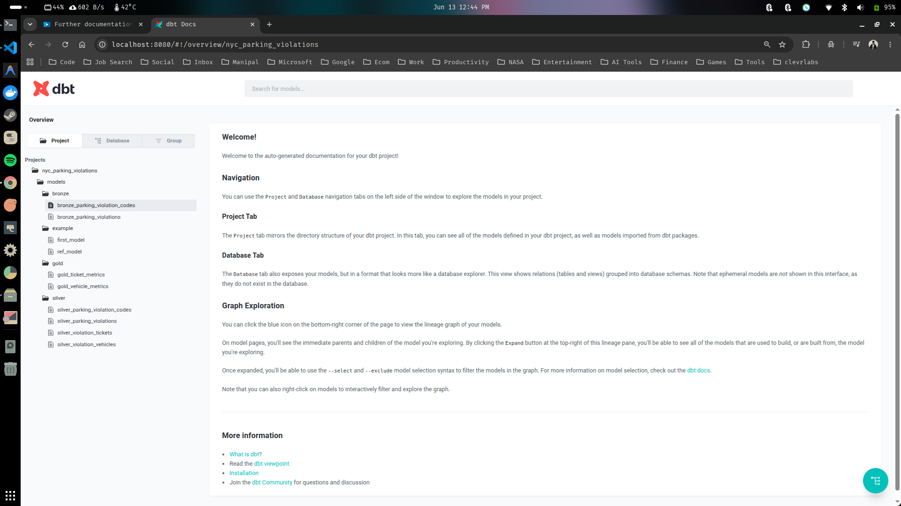
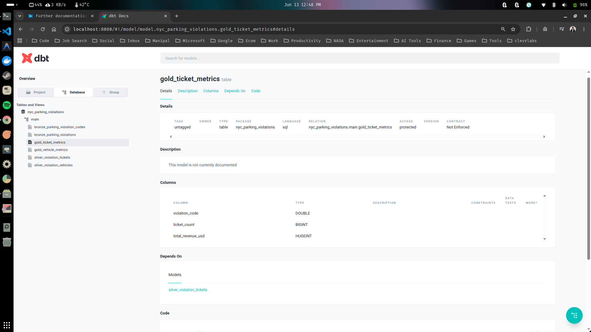
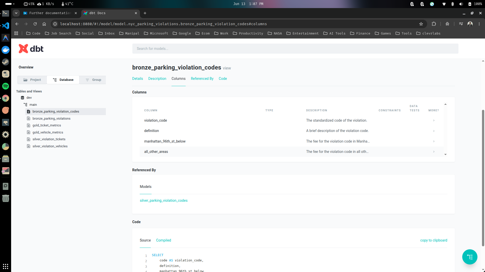

# Documentation as Code via DBT

Documentation is huge in data, it is how you understand what data your're using, how it connects to your project and more importantly it keeps everyone informed on the team. It is very hard to maintain documentation and this is where dbt is useful. DBT can use documentation as code. The documentation component of dbt is one of it's major selling point. 

Let's try this out.

### 1. Further documentation via schema.yml file. 

- Make sure you are inside your dbt project.

```sh
$ cd nyc_parking_violations/
```

- Run the dbt docs generate command.

```sh
$ dbt docs generate
```
```sh
08:41:48  Running with dbt=1.8.9
08:41:48  Registered adapter: duckdb=1.8.4
08:41:48  Found 10 models, 426 macros
08:41:48  
08:41:48  Concurrency: 1 threads (target='dev')
08:41:48  
08:41:48  Building catalog
08:41:48  Catalog written to /home/siddhu/Desktop/Data-Engineering-With-DBT/nyc_parking_violations/target/catalog.json
```

- Finally, run the dbt docs serve command.

```sh
$ dbt docs serve
```


*So now we have our project, we can see our various models and you can also check out the materialization from the database tab.*

- By clicking any one of the models you can check out the documentation for that model.



*We can see the documentation above but its not that much, either there is not much information there. So even though we already have our documentation we still need to fill it out. You can achieve this using dbt and is relatively easy.*

- Exit out the docs using the Ctrl + C command in the terminal and create a new folder inside the models directory called docs.

```sh
$ mkdir models/docs
```

- Create a new yaml configuration file called schema.yml inside the newly created docs folder.

```sh
$ touch models/docs/schema.yml
```

- Your models directory should look like the below one.

```text
.
├── bronze
├── example
├── gold
├── silver
└── docs
    └── schema.yml
```

- Copy paste the below yaml configutaion setting to the schema.yml file.

```yml
# models/docs/schema.yml
models:
  - name: bronze_parking_violation_codes
    description: Raw data representing parking violation codes and their fee descriptions.
    columns:
      - name: violation_code
        description: The standardized code of the violation.
      - name: definition
        description: A brief description of the violation code.
      - name: manhattan_96th_st_below
        description: The fee for the violation code in Manhattan below 96th Street.
      - name: all_other_areas
        description: The fee for the violation code in all other areas of New York City.
```

- Run dbt docs generate again.

```sh
$ dbt docs generate
```
```sh
09:05:04  Running with dbt=1.8.9
09:05:04  Registered adapter: duckdb=1.8.4
09:05:04  Unable to do partial parsing because profile has changed
09:05:05  Found 10 models, 426 macros
09:05:05  
09:05:05  Concurrency: 1 threads (target='dev')
09:05:05  
09:05:05  Building catalog
09:05:05  Catalog written to /home/siddhu/Desktop/Data-Engineering-With-DBT/nyc_parking_violations/target/catalog.json
```

- Run dbt docs serve. Now you might be able to see some descriptions for each columns.

```sh
$ dbt docs serve
```



We have created the description and you might wonder that doing it like this means that we have to write a lot of the documentation in there. In our next step we will looking into something called doc blocks, where you can actually create variables that you can use throughout your enture project, so you don't have to repeatly type the same thing over and over again. 

### 2. The doc_blocks.md file.

