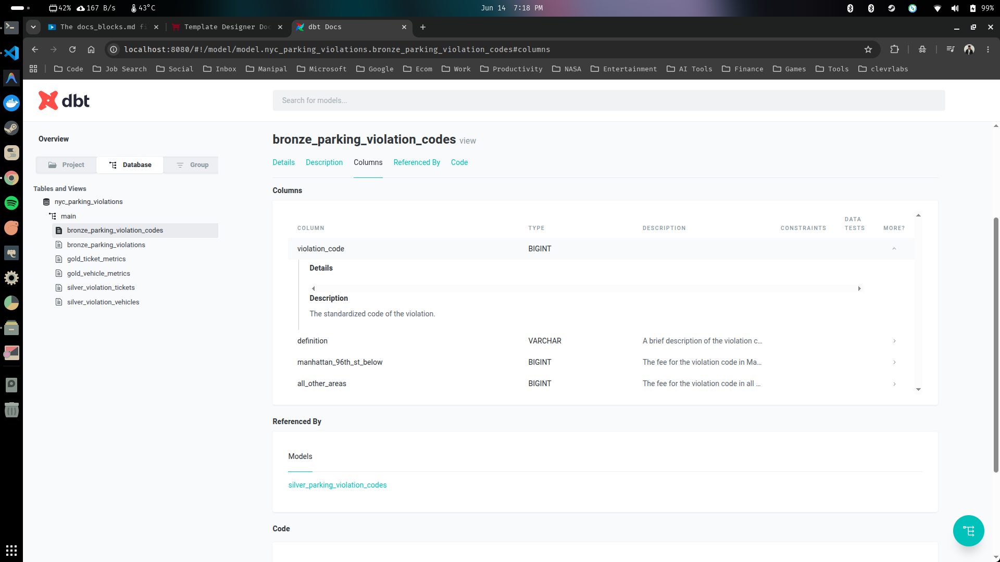
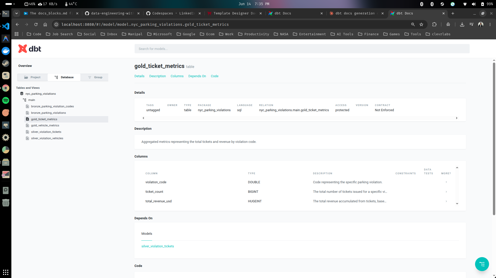

# Documentation as Code via DBT

Documentation is huge in data, it is how you understand what data your're using, how it connects to your project and more importantly it keeps everyone informed on the team. It is very hard to maintain documentation and this is where dbt is useful. DBT can use documentation as code. The documentation component of dbt is one of it's major selling point. 

Let's try this out.

### 1. Further documentation via schema.yml file. 

- Make sure you are inside your dbt project.

```sh
$ cd nyc_parking_violations/
```

- Run the dbt docs generate command.

```sh
$ dbt docs generate
```
```sh
08:41:48  Running with dbt=1.8.9
08:41:48  Registered adapter: duckdb=1.8.4
08:41:48  Found 10 models, 426 macros
08:41:48  
08:41:48  Concurrency: 1 threads (target='dev')
08:41:48  
08:41:48  Building catalog
08:41:48  Catalog written to /home/siddhu/Desktop/Data-Engineering-With-DBT/nyc_parking_violations/target/catalog.json
```

- Finally, run the dbt docs serve command.

```sh
$ dbt docs serve
```


*So now we have our project, we can see our various models and you can also check out the materialization from the database tab.*

- By clicking any one of the models you can check out the documentation for that model.


*We can see the documentation above but its not that much, either there is not much information there. So even though we already have our documentation we still need to fill it out. You can achieve this using dbt and is relatively easy.*

- Exit out the docs using the Ctrl + C command in the terminal and create a new folder inside the models directory called docs.

```sh
$ mkdir models/docs
```

- Create a new yaml configuration file called schema.yml inside the newly created docs folder.

```sh
$ touch models/docs/schema.yml
```

- Your models directory should look like the below one.

```text
.
├── bronze
├── example
├── gold
├── silver
└── docs
    └── schema.yml
```

- Copy paste the below yaml configutaion setting to the schema.yml file.

```yml
# models/docs/schema.yml
models:
  - name: bronze_parking_violation_codes
    description: Raw data representing parking violation codes and their fee descriptions.
    columns:
      - name: violation_code
        description: The standardized code of the violation.
      - name: definition
        description: A brief description of the violation code.
      - name: manhattan_96th_st_below
        description: The fee for the violation code in Manhattan below 96th Street.
      - name: all_other_areas
        description: The fee for the violation code in all other areas of New York City.
```

- Run dbt docs generate again.

```sh
$ dbt docs generate
```
```sh
09:05:04  Running with dbt=1.8.9
09:05:04  Registered adapter: duckdb=1.8.4
09:05:04  Unable to do partial parsing because profile has changed
09:05:05  Found 10 models, 426 macros
09:05:05  
09:05:05  Concurrency: 1 threads (target='dev')
09:05:05  
09:05:05  Building catalog
09:05:05  Catalog written to /home/siddhu/Desktop/Data-Engineering-With-DBT/nyc_parking_violations/target/catalog.json
```

- Run dbt docs serve. Now you might be able to see some descriptions for each columns.

```sh
$ dbt docs serve
```


We have created the description and you might wonder that doing it like this means that we have to write a lot of the documentation in there. In our next step we will looking into something called doc blocks, where you can actually create variables that you can use throughout your enture project, so you don't have to repeatly type the same thing over and over again. 

### 2. The doc_blocks.md file.

Doc blocks are essentially creating variables that you can pass along your DBT project documentation. The below is an example of how this looks like.

```text
# docs block

This is example text.

```

The above equivalents to:

```python
# python
example_name = 'This is example text.'
```

Lets get this started.

- Make sure you are inside your project folder and create your docs_block.md

```sh
$ cd nyc_parking_violations/
$ touch models/docs/docs_block.md
```

*Let's do a quick doc block for our violation codes.*

- Copy paste the below jinja function into your doc_blocks.md

```text

The standardized code of the violation.

```

- Go back to your schema.yml file, and for violation code we can completely replace its description with our doc block.

```yml
# models/docs/schema.yml
models:
  - name: bronze_parking_violation_codes
    description: Raw data representing parking violation codes and their fee descriptions.
    columns:
      - name: violation_code
        description: '{{ doc("violation_code")}}'
      - name: definition
        description: A brief description of the violation code.
      - name: manhattan_96th_st_below
        description: The fee for the violation code in Manhattan below 96th Street.
      - name: all_other_areas
        description: The fee for the violation code in all other areas of New York City.
```

*Now check whether if its working or not.*

- Run dbt docs generate command.

```sh
$ dbt docs
```
```sh
15:14:45  Running with dbt=1.8.9
15:14:46  Registered adapter: duckdb=1.8.4
15:14:46  Unable to do partial parsing because profile has changed
15:14:46  Found 10 models, 426 macros
15:14:46  
15:14:46  Concurrency: 1 threads (target='dev')
15:14:47  
15:14:47  Building catalog
15:14:47  Catalog written to /home/siddhu/Desktop/Data-Engineering-With-DBT/nyc_parking_violations/target/catalog.json
```

- Run dbt docs serve.

```sh
$ dbt docs serve
```


*We can see from the above screenshot that the description is still the same but now we've used the variable. This is extremely powerful because in engineering best practices it's called dry (dont repeat yourself)*

### 3. Finalizing our docs_block.md and schema.yml

- Copy paste the below jinja functions to docs_block.md

```text

Code representing the specific parking violation.



Description of the violation for a respective code.



The fee in $USD for a violation on or below Manhattan 96th Street.



The fee in $USD for a violation not on or below Manhattan 96th Street.



Unique identifier for each summons issued for a parking violation.



The state where the vehicle is registered.



The type of license plate.



The date when the summons was issued.



The body type of the vehicle involved in the violation.



The make or brand of the vehicle.



The agency that issued the summons.



The date when the vehicle's registration expires.



General location where the violation occurred.



Precinct where the violation was identified.



Precinct of the officer or official who issued the summons.



Unique code identifying the issuer.



Command or unit of the issuer.



Squad detail for the issuer.



Time when the violation occurred.



County where the violation took place.



Legal code associated with the violation.



Color of the vehicle involved in the violation.



Manufacturing year of the vehicle.



The fee charged for a parking violation, specified in USD. This fee varies depending on the location of the violation.



A boolean value indicating whether the violation occurred in Manhattan on or below 96th Street.



The total number of tickets issued for a specific violation code.



The total revenue accumulated from tickets, based on the violation code. This sum is represented in USD.

```

- Copy paste the below yml configuration to your schema.yml file.

```yml
models:
  - name: bronze_parking_violation_codes
    description: Raw data representing the violation codes and their fees.
    columns:
      - name: violation_code
        description: '{{ doc("violation_code") }}'
      - name: definition
        description: '{{ doc("definition") }}'
      - name: manhattan_96th_st_below
        description: '{{ doc("manhattan_96th_st_below") }}'
      - name: all_other_areas
        description: '{{ doc("all_other_areas") }}'

  - name: bronze_parking_violations 
    description: Raw data related to parking violations in 2023, encompassing various details about each violation.
    columns:
      - name: summons_number
        description: '{{ doc("summons_number") }}'
        data_tests:
          - unique
          - not_null
      - name: registration_state
        description: '{{ doc("registration_state") }}'
      - name: plate_type
        description: '{{ doc("plate_type") }}'
      - name: issue_date
        description: '{{ doc("issue_date") }}'
      - name: violation_code
        description: '{{ doc("violation_code") }}'
      - name: vehicle_body_type
        description: '{{ doc("vehicle_body_type") }}'
      - name: vehicle_make
        description: '{{ doc("vehicle_make") }}'
      - name: issuing_agency
        description: '{{ doc("issuing_agency") }}'
      - name: vehicle_expiration_date
        description: '{{ doc("vehicle_expiration_date") }}'
      - name: violation_location
        description: '{{ doc("violation_location") }}'
      - name: violation_precinct
        description: '{{ doc("violation_precinct") }}'
      - name: issuer_precinct
        description: '{{ doc("issuer_precinct") }}'
      - name: issuer_code
        description: '{{ doc("issuer_code") }}'
      - name: issuer_command
        description: '{{ doc("issuer_command") }}'
      - name: issuer_squad
        description: '{{ doc("issuer_squad") }}'
      - name: violation_time
        description: '{{ doc("violation_time") }}'
      - name: violation_county
        description: '{{ doc("violation_county") }}'
      - name: violation_legal_code
        description: '{{ doc("violation_legal_code") }}'
      - name: vehicle_color
        description: '{{ doc("vehicle_color") }}'
      - name: vehicle_year
        description: '{{ doc("vehicle_year") }}'

  - name: silver_parking_violation_codes
    description: "This model unifies violation codes, providing a comprehensive view of violations, indicating whether they occurred on/below 96th St in Manhattan or in other areas, along with the respective fees in USD."
    columns:
      - name: violation_code
        description: '{{ doc("violation_code") }}'
      - name: definition
        description: '{{ doc("definition") }}'
      - name: is_manhattan_96th_st_below
        description: '{{ doc("is_manhattan_96th_st_below") }}'
      - name: fee_usd
        description: '{{ doc("fee_usd") }}'

  - name: silver_parking_violations
    description: "Enhanced view of parking violations, enriched with details and specific indicators such as the flag for violations in Manhattan on or below 96th Street."
    columns:
      - name: summons_number
        description: '{{ doc("summons_number") }}'
      - name: registration_state
        description: '{{ doc("registration_state") }}'
      - name: plate_type
        description: '{{ doc("plate_type") }}'
      - name: issue_date
        description: '{{ doc("issue_date") }}'
      - name: violation_code
        description: '{{ doc("violation_code") }}'
      - name: vehicle_body_type
        description: '{{ doc("vehicle_body_type") }}'
      - name: vehicle_make
        description: '{{ doc("vehicle_make") }}'
      - name: issuing_agency
        description: '{{ doc("issuing_agency") }}'
      - name: vehicle_expiration_date
        description: '{{ doc("vehicle_expiration_date") }}'
      - name: violation_location
        description: '{{ doc("violation_location") }}'
      - name: violation_precinct
        description: '{{ doc("violation_precinct") }}'
      - name: issuer_precinct
        description: '{{ doc("issuer_precinct") }}'
      - name: issuer_code
        description: '{{ doc("issuer_code") }}'
      - name: issuer_command
        description: '{{ doc("issuer_command") }}'
      - name: issuer_squad
        description: '{{ doc("issuer_squad") }}'
      - name: violation_time
        description: '{{ doc("violation_time") }}'
      - name: violation_county
        description: '{{ doc("violation_county") }}'
      - name: violation_legal_code
        description: '{{ doc("violation_legal_code") }}'
      - name: vehicle_color
        description: '{{ doc("vehicle_color") }}'
      - name: vehicle_year
        description: '{{ doc("vehicle_year") }}'
      - name: is_manhattan_96th_st_below
        description: '{{ doc("is_manhattan_96th_st_below") }}'

  - name: silver_violation_tickets
    description: "Consolidated information on parking violations, enriched with associated fee details."
    columns:
      - name: summons_number
        description: '{{ doc("summons_number") }}'
      - name: issue_date
        description: '{{ doc("issue_date") }}'
      - name: violation_code
        description: '{{ doc("violation_code") }}'
      - name: is_manhattan_96th_st_below
        description: '{{ doc("is_manhattan_96th_st_below") }}'
      - name: issuing_agency
        description: '{{ doc("issuing_agency") }}'
      - name: violation_location
        description: '{{ doc("violation_location") }}'
      - name: violation_precinct
        description: '{{ doc("violation_precinct") }}'
      - name: issuer_precinct
        description: '{{ doc("issuer_precinct") }}'
      - name: issuer_code
        description: '{{ doc("issuer_code") }}'
      - name: issuer_command
        description: '{{ doc("issuer_command") }}'
      - name: issuer_squad
        description: '{{ doc("issuer_squad") }}'
      - name: violation_time
        description: '{{ doc("violation_time") }}'
      - name: violation_county
        description: '{{ doc("violation_county") }}'
      - name: violation_legal_code
        description: '{{ doc("violation_legal_code") }}'

  - name: silver_violation_vehicles
    description: "Details of the vehicles involved in parking violations."
    columns:
      - name: summons_number
        description: '{{ doc("summons_number") }}'
      - name: registration_state
        description: '{{ doc("registration_state") }}'
      - name: plate_type
        description: '{{ doc("plate_type") }}'
      - name: vehicle_body_type
        description: '{{ doc("vehicle_body_type") }}'
      - name: vehicle_make
        description: '{{ doc("vehicle_make") }}'
      - name: vehicle_expiration_date
        description: '{{ doc("vehicle_expiration_date") }}'
      - name: vehicle_color
        description: '{{ doc("vehicle_color") }}'
      - name: vehicle_year
        description: '{{ doc("vehicle_year") }}'

  - name: gold_ticket_metrics
    description: "Aggregated metrics representing the total tickets and revenue by violation code."
    columns:
      - name: violation_code
        description: '{{ doc("violation_code") }}'
      - name: ticket_count
        description: '{{ doc("ticket_count") }}'
      - name: total_revenue_usd
        description: '{{ doc("total_revenue_usd") }}'

  - name: gold_vehicles_metrics
    description: "Aggregated metrics detailing the number of tickets per vehicle, identified by the plate ID."
    columns:
      - name: registration_state
        description: '{{ doc("registration_state") }}'
      - name: ticket_count
        description: '{{ doc("ticket_count") }}'
```

*Now verify if everythings working as it should or not.*

- Run the dbt docs generate command.

```sh
$ dbt docs generate
```
```text
15:33:35  Running with dbt=1.8.9
15:33:35  Registered adapter: duckdb=1.8.4
15:33:35  Found 10 models, 2 data tests, 426 macros
15:33:35  
15:33:35  Concurrency: 1 threads (target='dev')
15:33:35  
15:33:35  Building catalog
15:33:36  Catalog written to /home/siddhu/Desktop/Data-Engineering-With-DBT/nyc_parking_violations/target/catalog.json
```

- Run the dbt docs serve

```sh
$ dbt docs serve
```



*You will be now able to see all the documentation for all of our tables now.*

---

<div align="center">

<h2>✦ Thank You For Reading This Guide ✦</h2>

> *May your pipelines never break and your queries always run fast.* 🚀

</div>